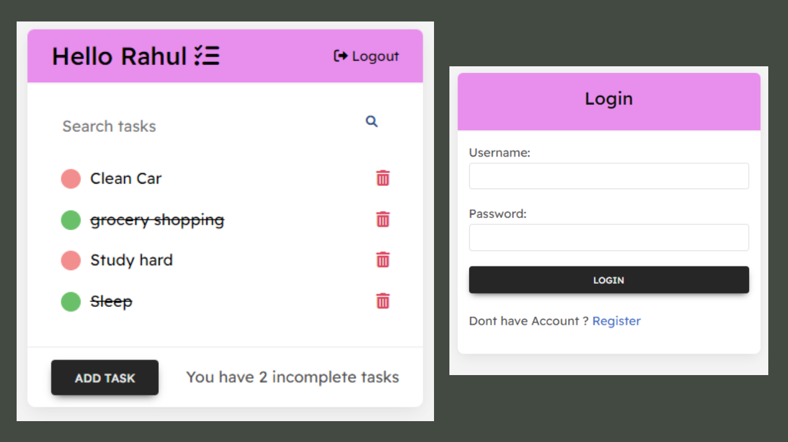

# Django-To-Do-list
Django ToDo list app with User Registration, Login, Search and full Create Read Update and DELETE functionality..



# Clone the repository 
```bash 
git clone https://github.com/rahulsrajput/Django-Todo-List-With-User-Authentication.git
```

# Setup
```
Install Python
```
### Create virtual environmnet
```
python3 -m venv .venv
```
### Activate virtual environment
##### For mac
```
source .venv/Scripts/activate
```
##### For windows
```
.venv\Scripts\activate
```
### Go to root directory of the current project which contain "manage.py file"
```
cd ./
```
### Install Requirements
```
pip install requirements.txt
```
### Run the manage.py
```
python manage.py runserver
```
### To access Django-Admin Pannel
#### First Create superuser
```
python manage.py createsuperuser
```

### To Deactivate virtual environment
```
deactivate
```